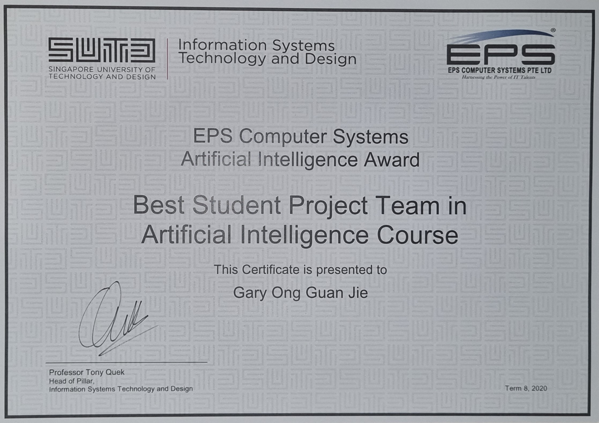
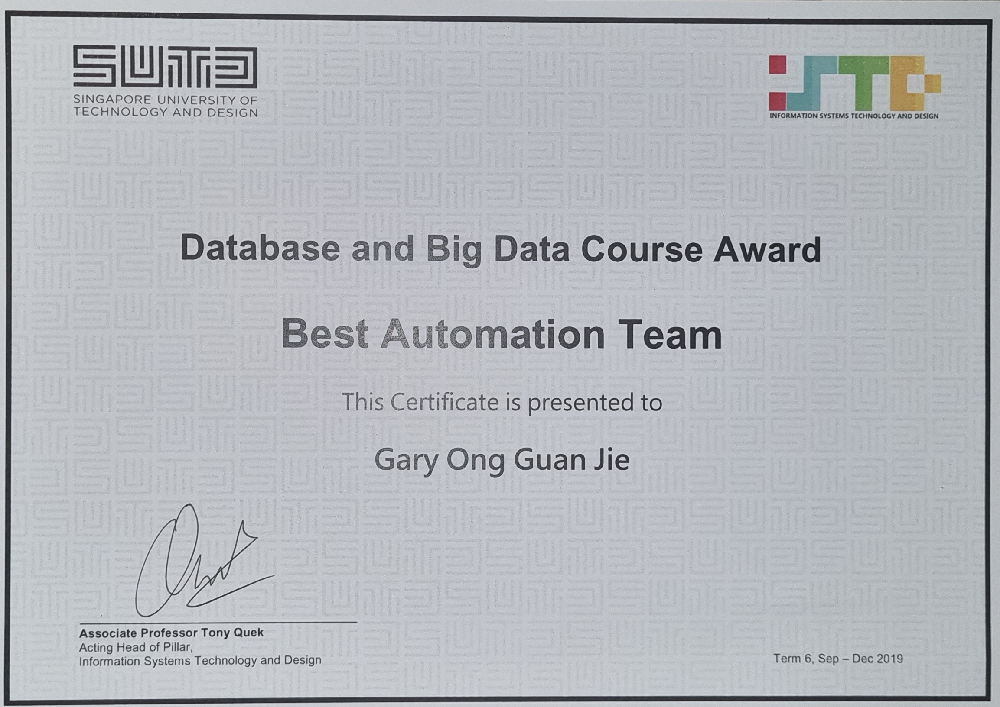
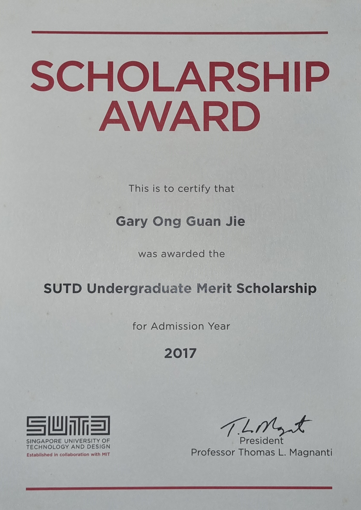

# Achievements

## Best AI Project in AI Course
- Connect4 AI was awarded Best AI project in 50.021 Artificial Intelligence course project

## Best Automation (DevOps) Award
- Best Automation for Book Review Project  in 50.043 Database and Big Data course project
- Used Boto3 and AWS CloudFormation script to deploy React, MySQL, MongoDB, Hadoop and Spark on more than 15 EC2 instances flawlessly

## SUTD Undergraduate Merit Scholarship
- Awarded to outstanding students with good academic performance

## 1st Place Kaggle Shopee Code League 2020 Sentiment Analysis Challenge
- Task was to predict ratings (1-5 stars) on Shopee product reviews 
- Used XLM_Roberta to achieve an accuracy score of 0.72, outperforming all teams (~700 teams in total) in both student and open category